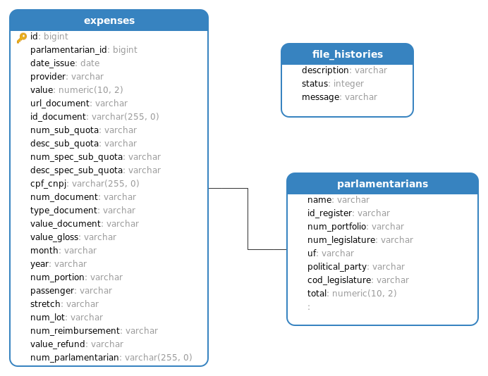

# Ranking dos Gastos de Deputados

A Cota para o Exercício da Atividade Parlamentar, custeia as despesas do mandato, como passagens aéreas e conta de celular. Algumas são reembolsadas, como as com os Correios, e outras são pagas por débito automático, como a compra de passagens. Nos casos de reembolso, os deputados têm três meses para apresentar os recibos. O valor mensal não utilizado fica acumulado ao longo do ano. Por esse motivo, em alguns meses o valor gasto pode ser maior que a média mensal. (Fonte: Portal da Câmara dos Deputados). Através do portal da transparência, nós temos acesso a essas despesas e podemos saber como e onde os políticos estão gastando.

# Gems

- chartkick & groupdate ( para gerar os gráficos )
- active_storage_validations ( validar o arquivo )
- csv ( ler o arquivo base )
- ransack ( filtros e ordenação das listagens )
- kaminari ( paginação )
- redis & sidekiq ( realizar ações em segundo plano )

## Pré-requisitos

- Ruby 2.7.1
- Redis
`sudo apt install redis`
`sidekiq -C config/sidekiq.yml`

- PostgreSQL
`rails db:create`
`rails db:migrate`

- Node & Yarn
`yarn install --check-files`
`rails webpacker:compile`

## Diagrama do DB

## Features
- [x] Possibilitar o upload do arquivo
- [x] Organizar os dados extraidos do arquivo em tabelas no banco de dados
- [x] Listagem dos deputados do seu estado
- [x] Mostrar o somatório dos seus gastos
- [x] Listar as despesas
- [x] Destacar a maior despesa do candidato
- [x] Usar o framework Rails
- [x] Exibir gráficos para melhorar a visualização dos gastos
- [x] Evitar N + 1 nas queries
- [x] Organizar estrutura do projeto utilizando padrões de projetos